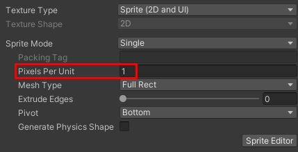
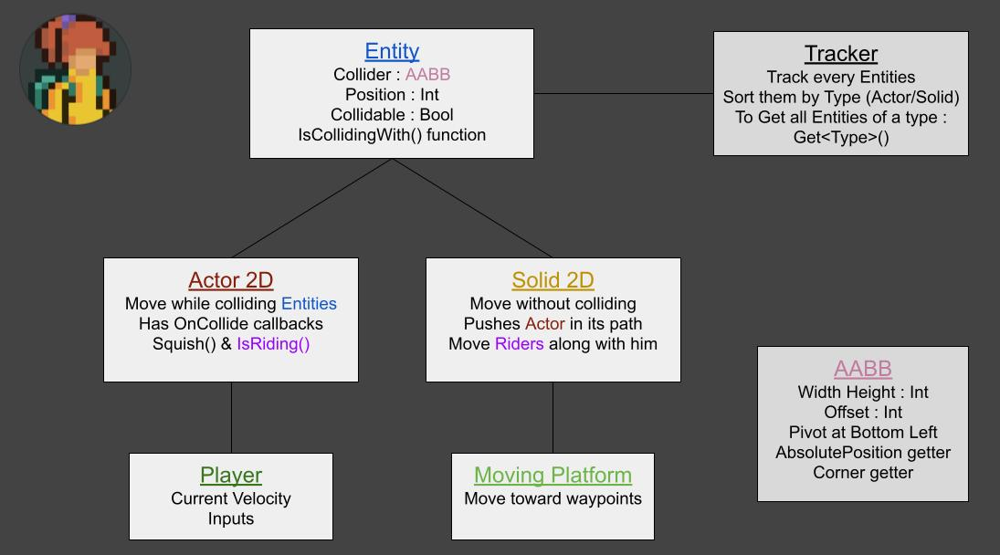

# Unity Pixel Perfect
### A pixel perfect physic & collisions solution for Unity 2D, inspired from Celeste

# Features
* Entities move 1 pixel per 1 pixel.
* Collision detection is optimized.
* Use a custom made collider class, which work with Pixel Size.

# How to use

First, one pixel of your sprites should equal 1 unit in Unity. To do so you need to use a PPU (Pixel Per Unit) of 1 in your sprites import settings.
Then, any geometry/level in your scene should use the component 'Entity' this will give them a collision box, and they will be tracked by the system.

#
For anything that will move, you have 2 choices

* --> If it need to move & collide (i.e a Player), you need to use a class which inherit from Actor2D (see Demo Scripts)
* --> If it need to move without colliding, but still pushing Actor2D in its path (i.e a Moving platform), you need to use a class which inherit from Solid2D (see Demo Scripts)

# Optimization & Perfomance
We use a PR-Tree to optimize collisions detection. Thanks to it, perfomance are extremely good with 1 Actor (i.e adding more and more static colliders almost don't affect perfomance). But it can still become laggy when their is a lot of Actors. I have not tested really deeply but as long as you don't have more than ~ 150-200 Actors in your scene it should be good.

The tree is built on scene load with all Entities in the scene. When Adding or Removing new entities, the tree is re-built from scratch.
This can cost a bit, depending of the Branch Factor in Tracker.cs. I suggest to have 2 trees, 1 for Awake, and 1 for runtimes. I may implement it myself

# Project Structure

